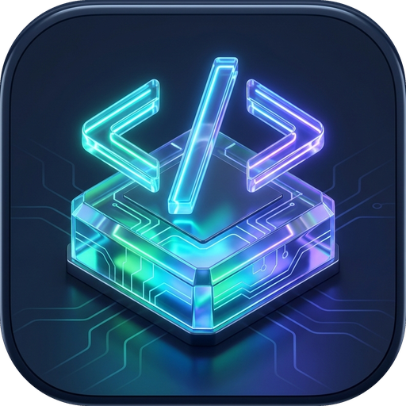

# 🚀 CodeQuest - Gamified Software Learning Platform

<p align="center">
  
</p>

<p align="center">
  <b>Yazılımcılar İçin 10 Farklı Patikada 16.000 Soru, Çözüm Açıklamaları & Duolingo Tarzı Oyunlaştırılmış Eğitim</b>
</p>

<p align="center">
  
  
  
  
  
  
  
  
</p>

---

## 📖 Genel Bakış

**CodeQuest**, yazılım geliştiricilerin temel seviyeden ileri seviyeye kadar en popüler dilleri, araçları ve mimari kavramları oyunlaştırılmış bir patika üzerinde eğlenerek öğrenmesini sağlayan modern bir Flutter uygulamasıdır.

İnteraktif yol haritası (winding learning path), Duolingo tarzı can (hearts), elmas (gems) ve deneyim puanı (XP) mekanikleri, Byte adındaki yapay zeka koçu, konu özetli hile kağıtları (cheat sheets), her soruda detaylı teknik çözüm açıklamaları ve her dilde canlı kod deneme konsolu (Playground) içerir.

---

## 🎯 10 Yazılım Patikası & Müfredat Özeti

Uygulamada her biri **8 Ünite**, ünite başına **8 Ders** ve ders başına **25 Soru** olmak üzere patika başına **1.600 Soru**, toplamda **16.000 Soru** bulunmaktadır:

| Patika | İkon | Ünite | Soru | Temel Konular |
| :--- | :---: | :---: | :---: | :--- |
| **Git & Versiyon Kontrol** | 🌿 | 8 | 1.600 | Temeller, .gitignore, Diff, Branching, 3-Way Merge, GitHub & PR, Rebase, Stash, Reflog, Bisect |
| **Godot 4 & Oyun Geliştirme**| 🎮 | 8 | 1.600 | GDScript 2.0, Düğümler, Sahneler, CharacterBody2D, Fizik, Sinyaller, UI, TileMap, Shader |
| **C Dili & Bellek Yönetimi** | ⚡ | 8 | 1.600 | Veri Tipleri, İşaretçiler (Pointers), Heap/Stack, Malloc/Free, Struct & Union, Bit Düzeyi İşlemler |
| **Python Quest** | 🐍 | 8 | 1.600 | Sözdizimi, List/Dict/Set, Comprehensions, Lambda, Decorators, OOP, Dunder Metotlar, Asyncio |
| **C# & .NET 8** | ⚙️ | 8 | 1.600 | Tipler, OOP, LINQ, Generics, Async/Await, Task, Dependency Injection, Stack/Heap |
| **Kotlin & Android** | 📱 | 8 | 1.600 | Null Safety (Elvis ?:), Scope Functions, Data Classes, Coroutines, Flow, Jetpack Compose |
| **Linux & Terminal** | 🐧 | 8 | 1.600 | Dizin Yönetimi, Pipe (\|), grep/awk/sed, chmod & chown İzinleri, Bash Scripting, Systemd |
| **JavaScript & Web** | 🌐 | 8 | 1.600 | ES6+, Array Metotları, Event Loop, Promise & Async/Await, DOM, Modüller, Web API'leri |
| **SQL & Veritabanı** | 🗄️ | 8 | 1.600 | DDL/DML, WHERE & ORDER, GROUP BY & HAVING, JOIN İlişkileri, İndeksler, ACID & Transaction |
| **Algoritmalar & Veri Yapıları**| 🧩 | 8 | 1.600 | Big-O Analizi, Stack/Queue, Ağaçlar & BST, Quicksort/Merge, Grafikler, Dinamik Programlama |
| **GENEL TOPLAM** | 🌟 | **80 Ünite** | **16.000 Soru** | **%100 Çözüm Açıklamalı Offline Yazılımcı Eğitim Kütüphanesi** |

---

## 💡 25 Soruluk Zengin Ders Formatı

Her ders, derinlemesine kavratıcı 5 farklı interaktif soru tipiyle zenginleştirilmiştir:
1. **1x Hap Bilgi (Concept Card):** Mimar kuralı, gerçek kod örneği, Byte geliştirici tavsiyesi ve konu özeti.
2. **16x Çoktan Seçmeli Senaryo Sorusu:** Kod çıktısı tahminleme, mantık hataları, bellek yönetimi ve mülakat senaryoları (Şıklar rastgele A, B, C, D olarak dağıtılmıştır).
3. **4x Boşluk Doldurma (Fill-in-the-Blank):** Kod bloklarında eksik anahtar sözcüğü veya operatörü tamamlama.
4. **2x Doğru / Yanlış:** Sektör pratikleri ve mimari kural denetimi.
5. **2x Eşleştirme (Matching Pairs):** Kavram-tanım ve komut-çıktı eşleştirmeleri.

---

## ✨ Öne Çıkan Özellikler

- **Offline-First Mimari:** Tüm sorular ve müfredat cihazda çevrimdışı çalışır, internet gerektirmez.
- **Byte Mascot Koçu:** Her patikada yazılımcıyı motive eden, ipuçları veren yapay zeka rehberi.
- **Hile Kağıtları (Cheat Sheets):** Her üniteye ait hızlı başvuru kod kartları.
- **Code Playground:** 10 farklı dil için önceden hazırlanmış şablonlarla interaktif kod deneme konsolu.
- **Oyunlaştırma & Başarımlar:** Günlük seri (streak), can sistemi, seviye atlama ve başarım ödülleri.
- **Modern Karanlık Tema:** Yazılımcı gözünü yormayan derin IDE renk paleti (Slate / Midnight Navy).

---

## 🛠️ Kurulum & Çalıştırma

```bash
# Depoyu klonlayın
git clone https://github.com/mraery/codequest.git
cd codequest

# Bağımlılıkları yükleyin
flutter pub get

# Uygulamayı çalıştırın
flutter run
```

### Release APK Derleme

```bash
flutter build apk --release
```
Derlenen APK dosyası `build/app/outputs/flutter-apk/app-release.apk` dizininde oluşur.

---

## 📄 Lisans

Bu proje MIT lisansı ile lisanslanmıştır.
